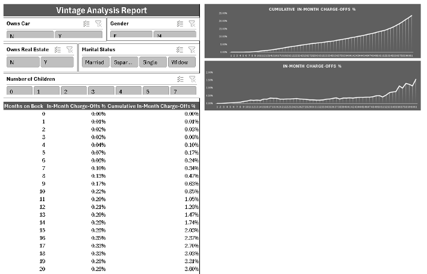
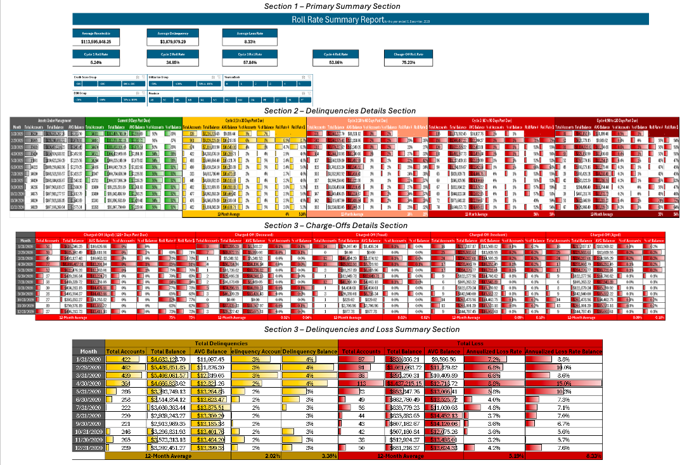
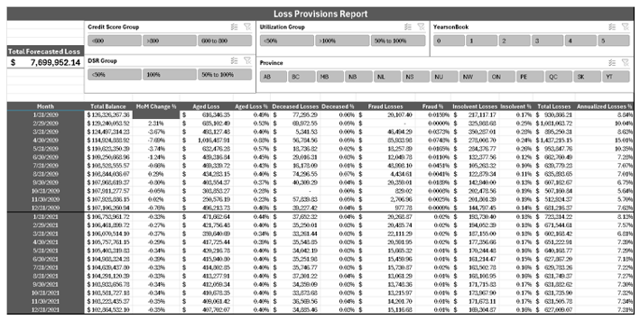
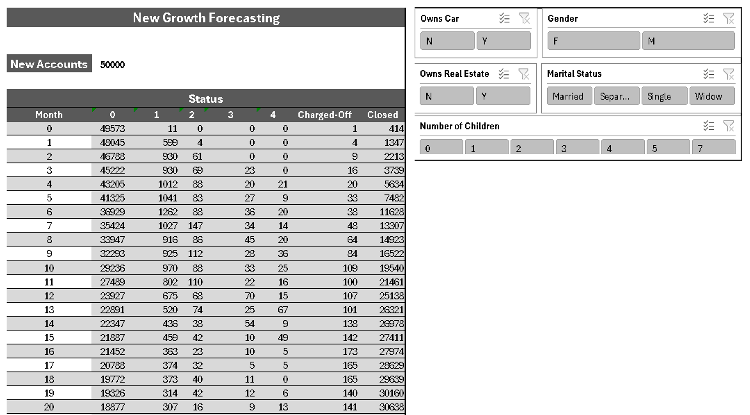

# Credit Risk Analysis

This repository contains the Excel-based reports used for assessing credit risk and projecting future losses in a financial institution. The reports created include:

- **Vintage Analysis Report**: Analyzes how accounts' statuses change over time based on the number of months they’ve been active. This helps in predicting future delinquencies and defaults.

 

- **Roll Rate Report**: Tracks the migration of delinquent accounts through different stages, such as from Current to Delinquent or Charged-Off. This report is used to assess credit risk based on customer demographics and behavior.

 

- **Loss Provisioning Report**: Projects future losses by analyzing historical data and applying forecasting techniques to estimate how many accounts will likely end up in default, and how much loss the company can expect.

 

- **New Growth Forecasting**: Uses historical account performance to forecast the number of new accounts that will likely be charged-off in the future. This report helps in projecting the performance of new loans or accounts under similar demographic conditions.

 

## Tools Used
- **Excel**
- **Power Query Editor**
- **Power Pivot**

## Datasets Used
- `Company 1 – Application Record.xlsx`
- `Company 1 – Credit Record.xlsx`
- `Company 2 – Application Record.xlsx`
- `Company 2 – Credit Record.xlsx`

## Objective
The goal of these reports is to assist credit risk and strategy teams in forecasting future losses and understanding the risks associated with delinquent accounts, segmented by different demographic and financial characteristics. These reports will also guide marketing teams in projecting the success of future campaigns.

### Key Features:
- **Slicers** for dynamic filtering of results by demographics (e.g., credit score, debt service ratio, and geography).
- **Forecasting** of future losses and provisions based on historical data.
- **Detailed Roll Rate** analysis to track account performance over time.
- **Vintage Analysis** to identify trends in account defaults.

## Results
These reports provide actionable insights for credit risk management, helping predict future losses with a high degree of accuracy.

---

## How to Use
1. Download the datasets.
2. Load the datasets into Excel using Power Query Editor.
3. Establish relationships between the datasets using Power Pivot.
4. Use the Vintage Analysis, Roll Rate, and Loss Provisioning tabs to analyze and project future credit risks and losses.

---

### Note:
Be sure to check the "Assumptions" section in the Loss Provisioning Report, as these assumptions are critical for understanding the basis of the forecasts.
 
## 🛠 Skills Used

Excel, Power Query, Power Pivot, Data Cleaning, Data Transformation, Data Visualization, Feature Engineering, Missing Value Imputation,  Forecasting, Charge-Off Prediction, Roll Rate Analysis, Loss Provision Forecasting, Pivot Tables, Slicers, Dynamic Dashboards, 
Data Analysis for Financial Reports, KPI Calculation

## 🚀 About Me
Hi 👋, I'm Ahmad Munir

A dedicated Artificial Inteligence Specialist

💬 Ask me about AI, ML, DL

📫 How to reach me ahnather2@gmail.com

## 🔗 Links

